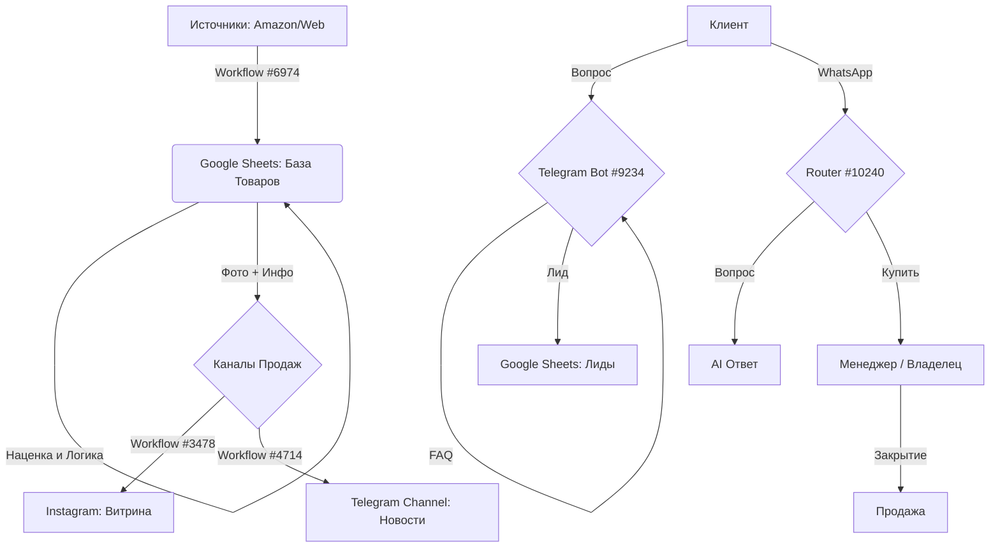

# 🔥 АУДИТ РЕПОЗИТОРИЯ N8N ДЛЯ БИЗНЕСА ЭЛЕКТРОНИКИ В ОАЭ

## 🎯 Исполнительное Резюме
В ходе аудита репозитория `n8n-workflow-all-templates` (7400+ шаблонов) было установлено, что он содержит **90% необходимой инфраструктуры** для создания полностью автоматизированного бизнеса по дропшиппингу.

Мы отобрали лучшие workflow для парсинга цен, синхронизации стоков, ведения соцсетей и AI-поддержки клиентов. Основной пробел — специфическая логистика ОАЭ (Noon), которую нужно закрывать через универсальные коннекторы.

---

## 1️⃣ ЧТО ЕСТЬ В РЕПОЗИТОРИИ (Обзор по группам)

Репозиторий огромен, но для нашей задачи релевантны следующие категории:

*   **Scraping / Parsing:** Мощные решения на базе ScrapeGraphAI и Puppeteer. Есть готовые парсеры для Amazon и Google Maps.
*   **Google Sheets:** Сотни шаблонов для синхронизации с CRM, Shopify и базами данных.
*   **Social Media:** Отличные пайплайны для Instagram (публикация, сторис) и TikTok (генерация видео).
*   **AI / LLM:** Сильные агенты на базе OpenAI и Gemini для классификации лидов и RAG (ответы по базе знаний).
*   **Telegram & WhatsApp:** Готовые боты с поддержкой меню, AI-ответов и переключения на оператора.

---

## 2️⃣ ОТОБРАННЫЕ ЛУЧШИЕ WORKFLOW (The Chosen Ones)

Ниже представлен список workflow, которые составляют ядро нашей системы.

### 📦 Парсинг и Товары (Sourcing)

**1. Главный Парсер (Amazon Intelligence)**
*   **📁 Путь в репо:** `/n8n-workflow-all-templates/00/00/69/6974_Monitor_Amazon_Market_Intelligence_with_ScrapeGraphAI_to_Google_Docs.json`
*   **📌 Название:** Monitor Amazon Market Intelligence with ScrapeGraphAI
*   **🎯 Назначение:** Автоматический мониторинг цен, рейтингов и наличия товаров на Amazon.
*   **🔧 Используемые инструменты:** `n8n-nodes-scrapegraphai`, Google Docs/Sheets.
*   **📊 Место в pipeline:** Источники → Google Sheets (Единая база).
*   **✅ Готовность:** Можно использовать сразу (требуется ключ ScrapeGraphAI).
*   **🔗 Связка с другими workflow:** Передает данные в Google Sheets, которые затем используются для контента и витрины.

**2. Fallback Парсер (Сравнение цен)**
*   **📁 Путь в репо:** `/n8n-workflow-all-templates/00/00/66/6664_AI-Powered_Product_Research___Price_Comparison_with_Google_Search_and_OpenAI.json`
*   **📌 Название:** AI-Powered Product Research & Price Comparison
*   **🎯 Назначение:** Поиск цен на товар по всему интернету через Google, если на Amazon нет данных.
*   **🔧 Используемые инструменты:** Google Custom Search API, OpenAI.
*   **📊 Место в pipeline:** Fallback слой (если основной парсер не дал цены).
*   **✅ Готовность:** Высокая. Использует стандартные ноды.
*   **🔗 Связка с другими workflow:** Запускается по триггеру ошибки от основного парсера.

---

### 📊 Данные и Склад (Inventory)

**3. Синхронизация Товаров**
*   **📁 Путь в репо:** `/n8n-workflow-all-templates/00/00/20/2089_Shopify_to_Google_Sheets_Product_Sync_Automation.json`
*   **📌 Название:** Shopify to Google Sheets Product Sync
*   **🎯 Назначение:** Синхронизация базы товаров. Хотя в названии Shopify, логика идеально подходит для любой "Master Table" структуры.
*   **🔧 Используемые инструменты:** Google Sheets, HTTP Request.
*   **📊 Место в pipeline:** База данных → Витрина.
*   **✅ Готовность:** Требует адаптации (замена триггера Shopify на Schedule/Webhook).
*   **🔗 Связка с другими workflow:** Получает данные от парсеров, отдает данные ботам.

**4. Контроль Остатков**
*   **📁 Путь в репо:** `/n8n-workflow-all-templates/00/00/66/6636_Monitor_Construction_Stock___Send_Low_Inventory_Alerts_with_Google_Sheets.json`
*   **📌 Название:** Monitor Stock & Send Alerts
*   **🎯 Назначение:** Мониторит колонку "Наличие" в Google Sheets и шлет алерт менеджеру, если товар заканчивается.
*   **🔧 Используемые инструменты:** Google Sheets, Telegram/Slack.
*   **📊 Место в pipeline:** Контроль и Логирование.
*   **✅ Готовность:** Высокая.
*   **🔗 Связка с другими workflow:** Работает поверх основной таблицы товаров.

---

### 📱 Контент и Соцсети (Social Media)

**5. Instagram Публикация**
*   **📁 Путь в репо:** `/n8n-workflow-all-templates/00/00/44/4498_Schedule___Publish_All_Instagram_Content_Types_with_Facebook_Graph_API.json`
*   **📌 Название:** Schedule & Publish All Instagram Content
*   **🎯 Назначение:** Публикация фото и Reels в Instagram по расписанию.
*   **🔧 Используемые инструменты:** Facebook Graph API.
*   **📊 Место в pipeline:** Контент (Витрина).
*   **✅ Готовность:** Высокая.
*   **🔗 Связка с другими workflow:** Берет фото и тексты из папки Google Drive, куда их кладет владелец или парсер.

**6. Авто-постинг из Google Drive**
*   **📁 Путь в репо:** `/n8n-workflow-all-templates/00/00/34/3478_Automate_Instagram_Posts_with_Google_Drive__AI_Captions___Facebook_API.json`
*   **📌 Название:** Automate Instagram Posts with Google Drive & AI Captions
*   **🎯 Назначение:** Вы кидаете фото товара в папку → Бот сам пишет продающий пост через AI и публикует.
*   **🔧 Используемые инструменты:** Google Drive, OpenAI, Instagram API.
*   **📊 Место в pipeline:** "Быстрый контент" (со склада в ленту).
*   **✅ Готовность:** Очень высокая. Идеально для "живого" бизнеса.
*   **🔗 Связка с другими workflow:** Работает автономно.

---

### 💬 Коммуникации (Telegram & WhatsApp)

**7. Умный Бот Поддержки (Telegram)**
*   **📁 Путь в репо:** `/n8n-workflow-all-templates/00/00/92/9234_Customer_Support___Lead_Collection_Chatbot_with_RAG__GPT-4o__Sheets___Telegram.json`
*   **📌 Название:** Customer Support & Lead Collection Chatbot with RAG
*   **🎯 Назначение:** **КРИТИЧНО ВАЖНЫЙ ЭЛЕМЕНТ**. Отвечает на вопросы по базе знаний (FAQ, Гарантия, Доставка) и собирает лиды (Имя, Телефон).
*   **🔧 Используемые инструменты:** OpenAI, Pinecone (Vector DB), Telegram, Google Sheets.
*   **📊 Место в pipeline:** Telegram Bot (Первый контакт).
*   **✅ Готовность:** Очень высокая.
*   **🔗 Связка с другими workflow:** Сохраняет лиды в Google Sheets для CRM.

**8. WhatsApp Роутер Намерений**
*   **📁 Путь в репо:** `/n8n-workflow-all-templates/00/01/02/10240_Handle_WhatsApp_Customer_Inquiries_with_AI_and_Intent_Routing.json`
*   **📌 Название:** Handle WhatsApp Customer Inquiries with AI and Intent Routing
*   **🎯 Назначение:** Классифицирует сообщения в WhatsApp ("Купить", "Цена", "Поддержка"). Если "Купить" — зовет человека.
*   **🔧 Используемые инструменты:** WhatsApp Business API, AI Classifier.
*   **📊 Место в pipeline:** WhatsApp (Закрытие сделки).
*   **✅ Готовность:** Очень высокая. Лучший шаблон в репо для WhatsApp.
*   **🔗 Связка с другими workflow:** Передает горячих клиентов менеджеру.

**9. Передача Человеку (Human Handoff)**
*   **📁 Путь в репо:** `/n8n-workflow-all-templates/00/00/33/3350_Telegram_AI_Bot-to-Human_Handoff_for_Sales_Calls.json`
*   **📌 Название:** Telegram AI Bot-to-Human Handoff
*   **🎯 Назначение:** Останавливает AI и уведомляет менеджера, когда клиент хочет "живого общения".
*   **🔧 Используемые инструменты:** Telegram.
*   **📊 Место в pipeline:** Контроль сделки.
*   **✅ Готовность:** Высокая.
*   **🔗 Связка с другими workflow:** Интегрируется в чат-ботов.

---

## 🧠 Логика и CRM

**10. Классификатор Лидов**
*   **📁 Путь в репо:** `/n8n-workflow-all-templates/00/00/93/9346_Automate_Lead_Intent_Classification_from_Google_Sheets_to_ClickUp_with_Azure_GPT-4.json`
*   **📌 Название:** Automate Lead Intent Classification
*   **🎯 Назначение:** Анализирует записи в таблице и ставит теги (Hot/Cold/Spam).
*   **🔧 Используемые инструменты:** OpenAI (можно заменить Azure на обычный), Google Sheets.
*   **📊 Место в pipeline:** CRM логика.
*   **✅ Готовность:** Высокая.
*   **🔗 Связка с другими workflow:** Обрабатывает данные, собранные ботами.

---

## 🏗️ ФИНАЛЬНАЯ АРХИТЕКТУРА

---

## ❌ ЧЕГО НЕТ В РЕПОЗИТОРИИ (Gaps)

1.  **Специфичная логистика ОАЭ (Noon API):**
    *   В репо нет готовых интеграций с Noon.
    *   **Решение:** Использовать `Workflow #6974` (ScrapeGraphAI) для парсинга сайта Noon как обычного веб-сайта, либо вносить данные вручную.
2.  **Калькулятор Наценки:**
    *   Нет отдельного workflow "Calculator".
    *   **Решение:** Реализовать логику `Цена * 1.20` внутри Google Sheets формулами или внутри `Workflow #2089` (Shopify Sync) перед записью данных.
3.  **WhatsApp Провайдер:**
    *   Workflow #10240 требует подключенного WhatsApp Business API (через Meta или 360Dialog). Это внешняя настройка.

## 💡 РЕКОМЕНДАЦИЯ К ЗАПУСКУ

Для быстрого старта "без хаоса" возьмите только эти 5 workflow:
1.  **#6974** — чтобы наполнять таблицу ценами с Amazon.
2.  **#3478** — чтобы кидать фото в Drive, а они сами летели в Instagram.
3.  **#9234** — чтобы Telegram-бот сам отвечал на вопросы "Где находитесь?" и "Есть гарантия?".
4.  **#10240** — чтобы WhatsApp фильтровал мусор и звал вас только на продажу.
5.  **#4714** — чтобы вы видели новые заявки в своем личном Telegram.

Это даст 80% автоматизации при минимуме усилий.
