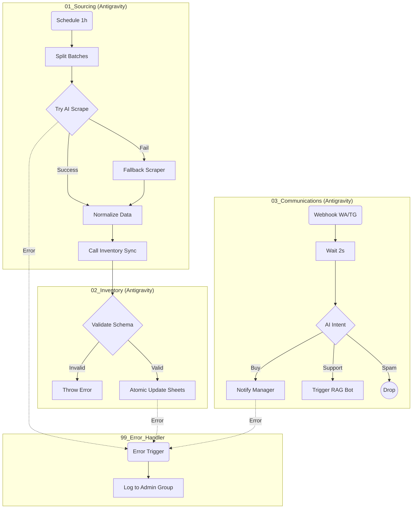

# 🏗️ Antigravity Architecture: UAE Electronics Dropshipping

This document visualizes the **production-ready logic** implemented in the JSON workflows.

## 🔄 System Pipeline

## 🛡️ Antigravity Principles Applied

1.  **Strict Isolation:** Sourcing does not touch the database directly; it sends data to the Inventory Sync workflow via Webhook. This decouples the scrapers from the storage logic.
2.  **Schema Validation:** The Inventory workflow *rejects* data that doesn't match the strict schema (Price > 0, Title present), protecting the database from "garbage in".
3.  **Graceful Fallback:** If the expensive AI scraper fails, the system automatically falls back to the cheaper Puppeteer scraper.
4.  **Intent Buffering:** The Chat Router waits 2 seconds to collect potential multi-message bursts from users before processing, saving AI tokens and reducing noise.
5.  **Centralized Logging:** All errors flow to a single `99_Error_Handler` workflow, ensuring no silent failures.
