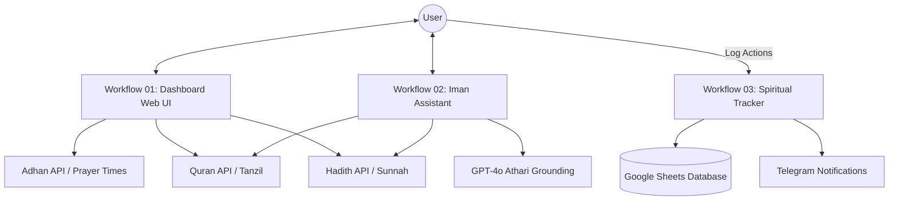

# DeenFlow System Architecture

## Data Flow
- **Dashboard**: Serves as the primary entry point, aggregating real-time data from AlAdhan, Quran Cloud, and Hadith APIs to present a "Today" view. Support for dynamic city/country via query params.
- **Assistant**: Uses an AI Agent with a strict system prompt. Grounding is provided via search tools targeting authentic Quranic and Hadith datasets.
- **Tracker**:
    - **Reminders**: Scheduled triggers (Fajr, Isha) with "Life Mode" logic (Student/Worker) send tailored Telegram reminders.
    - **Logging**: A dedicated Webhook endpoint accepts POST requests to log spiritual progress to Google Sheets.
